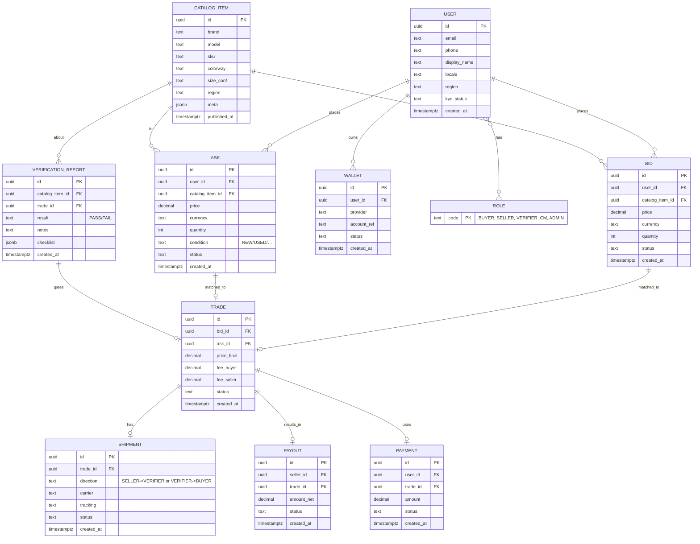

# WebLab#1 — Анализ и проектирование (Биржа коллекционных вещей для СНГ/Азии)

**Проект**: Биржа коллекционной одежды и электроники для рынков СНГ и Азии.  
**Ключевое отличие**: выставлять лоты можно **только** из предзаполненного системного каталога (никаких произвольных товаров). Это обеспечивает быстрый поиск и контроль предметной области на физическом уровне сервиса. Биржевая модель позволяет формализовать взаимодействие между пользователями на платформе. 
__Замечание:__ В теории биржевая модель может позволить подключать третьи страны.
---

## Цель и решаемая проблема / предоставляемая возможность

**Цель** — создать торговую площадку для коллекционных вещей по принципу биржи, где:
- исключена энтропия наименований товаров за счёт **строгого каталога товаров**;
- снижена вероятность получить неподлинный товар за счет **верификации** товара;
- сделки проходят через **биржевую модель** (ставки/офферы, клиринг, комиссия);
- есть **верификация** подлинности и **логистическая цепочка** (селлер → проверка → покупатель).

**Проблема рынка**: на классических досках объявлений (Avito, OLX, eBay, Wallapop, FacebookMarket) высокая энтропия ассортимента, а также проверка товара происходит посредством **видео, фото** верификации, не учитывая физические материалы товара (актуально для одежды). Взаимодействие между пользователями происходит посредством общения в чатах, что также добавляет риски быть обманутым. Биржевая модель несёт ответственность за подлинность товара и анонимность участников сделки.

**Возможность**: «биржевой» UX, физическая проверка подлинности, все взаимодействия посредством биржи.

## Сравнение
- 


## Краткий перечень функциональных требований

1. **Каталог**
   - CRUD для сущностей каталога: Бренд, Модель, Артикул (SKU), Выпуск/Релиз, Цвет, Размер/Конфигурация, Наименование.
   - Импорт/версионирование справочника, модерация карточек (роль: Редактор/Админ).
   - Поиск и фильтры: бренд, модель, размер, состояние (**только** new/ **дополнительно**used).

2. **Биржевые операции**
   - **Bid** (покупательская заявка) и **Ask** (продающая заявка) на конкретный `CatalogItem`.
   - Автосовпадение по правилам книги заявок (order book): лучшая цена/время.
   - Завершение сделки → создание **Trade** (с фиксацией комиссии и налогов).

3. **Уведомления и подписки**
    - **Подписка** на товар для отслеживания изменения.
    - **Уведомление** о достижении целовой цены. 

4. **Аудит и мониторинг**
   - Логи аутентификации, бизнеса (ордера, трейды), доставки, ошибок.
   - Сводки в `/monitoring`.

5. **Платежи/выплаты**
   - Резервирование средств покупателя (escrow), списание комиссии, **Payout** селлеру.
   - Интеграция с провайдером платежей; моки/эмуляторы.

6. **Профили и роли**
   - Пользователи: Покупатель, Продавец, Модератор/Аутентификатор, Редактор, Админ.
   - KYC/верификация аккаунта, 2FA. Сессии, JWT (для последующих ЛР).

7. **Нефункциональные требования**
   - Производительность каталога и поисковых фильтров.
   - Надёжность workflow сделки (идемпотентность вебхуков/ретраев).
   - Масштабируемость (деление на сервисы), отказоустойчивость.

8. **Сделка и логистика __Доп__**
   - Отправка товара селлером в верификационный центр → **VerificationReport** (подлинность/состояние).
   - Если OK — пересылка покупателю (**Shipment**), если нет — возврат/эскалация.
   - Отслеживание статусов, SLA, трекинг отправлений.


## Usecase диаграмма 


## BPMN #1 — Модерация каталога (нелинейный процесс)


## BPMN #2 — Биржевая сделка (Bid/Ask → Trade)


## BPMN #3 — Покупка товара


## BPMN #4 — Продажа товара


## Примеры пользовательских сценариев (3+)

1. **Покупка «в один клик по лучшей цене»**
   - Пользователь находит `CatalogItem`, жмёт «Купить по лучшей цене» → система создаёт Bid, мэчит с лучшим Ask, блокирует средства, запускает логистику и верификацию.

2. **Продажа «в один клик по лучшей цене»**
- Пользователь находит `CatalogItem`, жмёт «Продать по лучшей цене» → система создаёт Ask, мэчит с лучшим Bid, создает сделку, запускает логистику и верификацию.

3. **Выставление Ask c авто‑продлением**
   - Продавец выбирает `CatalogItem`, указывает данные, включает авто‑обновление цены при отсутствии спроса, система управляет Ask в книге заявок.

4. **Выставление Bid c авто‑продлением**
    - Покупатель выбирает `CatalogItem`, указывает таргетную цены, система добавляет Bid книгу предожений.

5. **Подписка на изменение цены**
    - Пользователь заходит в приложение. Выбирает интересующий товар и подписывается на изменение цены.

6. **Уведомление о достижении цены**
    - Пользователь заходит в приложение. Выбирает интересующий товар и создает уведомление для ценового уровня товара.

**__Доп__**
1. **Эскалация при провале проверки**
    - Верификатор фиксирует несоответствие → система останавливает сделку, уведомляет стороны, инициирует возврат и черный список для селлера при повторных нарушениях.

2. **Импорт релизов по бренду**
    - Редактор импортирует CSV от бренда → система валидирует, ищет дубликаты, публикует новые SKU с версионированием.


## ER‑диаграмма (Mermaid ER)




## Технологический стек

- **Backend**: Kotlin + Ktor (чистая архитектура, Repository;), DAO, Coroutines.
- **БД**: PostgreSQL 16, схемы/миграции (Flyway), JSONB для гибких атрибутов, индексы GIN.
- **Кэш/поиск**: Redis (кэш фильтров и популярных запросов); по желанию — Meilisearch/Elastic.
- **API**: REST /api/v1 (OpenAPI 3.1), подготовка к /api/v2. JWT.
- **Gateway/Web‑server**: Nginx (маршрутизация, статика, gzip, кэш), подготовка к балансировке .
- **Messaging (доп)**: RabbitMQ асинхронные события сделок/логистики; 
- **Frontend (доп)**: React + TypeScript + Vite (SPA, Remote Facade), Jest/Vitest.
- **CI/CD**: GitHub Actions (линтеры, тесты, сборка docker‑образов).
- **Observability**: Grafana + Loki, Prometheus + exporters (подготовка к /monitoring).
- **Delivery**: Docker Compose (стенд).

## Диаграмма БД (ключевые связи и ограничения)

- Все PK — `uuid`; внешние ключи с каскадами там, где это безопасно (например, удаление пользователя **не** каскадит сделки).
- Уникальные ограничения: `CatalogItem(sku, size_conf, region)`, `Role(code)`, уникальный `email` у `User`.
- Индексы: B‑tree по внешним ключам; `gin` по `CatalogItem.meta` и `VerificationReport.checklist`.
- Идемпотентность: таблица `payment` хранит `provider_request_id` с `UNIQUE` для защиты от дублей.


## Компонентная диаграмма

```mermaid
flowchart LR
  Browser[SPA (React TS)] -->|REST /api/v1| API[Ktor API Gateway]
  API --> Core[Core Service (Domain)]
  Core --> DS[Data Service (PostgreSQL + Redis)]
  Core --> MQ[(RabbitMQ)]
  VerifierApp[Verifier Console/TUI] -->|Events| MQ
  AdminUI[Admin UI] -->|REST| API
  Monitoring[(Grafana+Loki)] <-->|logs/metrics| API
  Monitoring <-->|logs/metrics| Core
  Monitoring <-->|logs/metrics| DS
```


## Черновые эскизы экранов (wireframes)


